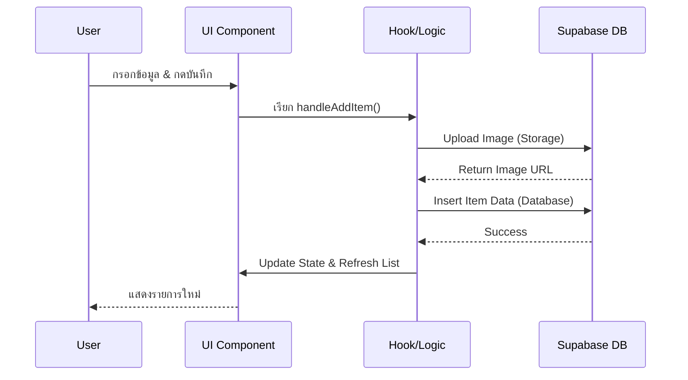

# 🛠️ Technical Deep Dive

เอกสารนี้อธิบายการทำงานเชิงลึกของระบบ FinderHub โดยเน้นที่ตรรกะเบื้องหลัง (Logic), การจัดการข้อมูล (Data Handling), และความปลอดภัย (Security)

---

## 📑 Table of Contents

- [1. 💻 Tech Stack & Rationale](#1--tech-stack--rationale)
- [2. 🧩 Component-Based Architecture & Hooks](#2--component-based-architecture--hooks)
- [3. 🚀 DevOps & Deployment Workflow](#3--devops--deployment-workflow)
- [4. 🔍 Search & Filter Logic](#4--search--filter-logic)
- [5. 🔃 Sorting Mechanism](#5--sorting-mechanism)
- [6. 🔐 Admin Authentication](#6--admin-authentication)
- [7. 🌐 API & Data Architecture](#7--api--data-architecture)
- [8. 🌊 Data Flow Diagram](#8--data-flow-diagram)
- [9. 🗄️ Database Schema & Security](#9--database-schema--security)

---

## 1. 💻 Tech Stack & Rationale

เหตุผลในการเลือกใช้เทคโนโลยีต่างๆ ในโปรเจกต์นี้ เพื่อให้มั่นใจในประสิทธิภาพ (Performance), ความสามารถในการขยายตัว (Scalability), และประสบการณ์ของผู้พัฒนา (DX):

### ⚛️ React 19 & Next.js 16

- **Why**: รองรับ Server Components และ Server Actions เพื่อลดการส่ง JavaScript ไปยัง Client
- **Code Example (Server Action)**:

  ```javascript
  // src/app/actions.js
  "use server";

  export async function addItem(formData) {
    const name = formData.get("name");
    await supabase.from("items").insert({ name });
    revalidatePath("/admin"); // Update UI immediately
  }
  ```

### 🎨 Tailwind CSS 4

- **Why**: Styling ที่รวดเร็วและไม่มี Runtime Overhead
- **Code Example**:
  ```jsx
  // Utility-first classes
  <button className="bg-blue-600 hover:bg-blue-700 text-white font-bold py-2 px-4 rounded-full transition-all">
    แจ้งของหาย
  </button>
  ```

### ⚡ Supabase

- **Why**: ครบจบในที่เดียว (DB, Auth, Storage)
- **Code Example (Client Initialization)**:

  ```javascript
  import { createClient } from "@supabase/supabase-js";

  const supabase = createClient(
    process.env.NEXT_PUBLIC_SUPABASE_URL,
    process.env.NEXT_PUBLIC_SUPABASE_ANON_KEY
  );
  ```

### 🐙 GitHub & Vercel

- **Why**: CI/CD Pipeline ที่สมบูรณ์แบบ
- **Integration**: Push to `main` -> GitHub Actions (Test) -> Vercel (Deploy)

---

## 2. 🧩 Component-Based Architecture & Hooks

FinderHub ถูกออกแบบโดยยึดหลัก **Component-Based Architecture** ซึ่งเป็นหัวใจสำคัญของ React

### 🧱 Component Structure

**ตัวอย่างการใช้งาน Component (`ItemCard`):**

```jsx
// src/components/ui/ItemCard.jsx
export default function ItemCard({ item }) {
  return (
    <div className="border rounded-lg overflow-hidden shadow-sm hover:shadow-md transition">
      
      <div className="p-4">
        <Badge status={item.status} />
        <h3 className="font-bold mt-2">{item.name}</h3>
        <p className="text-gray-500 text-sm">{item.location}</p>
      </div>
    </div>
  );
}
```

### 🎣 React Hooks Strategy

**ตัวอย่าง Custom Hook (`useAdminDashboard`):**

```javascript
// src/hooks/useAdminDashboard.js
export function useAdminDashboard() {
  const [items, setItems] = useState([]);
  const [isLoading, setIsLoading] = useState(true);

  const loadData = async () => {
    setIsLoading(true);
    const data = await DataManager.getAllItems();
    setItems(data);
    setIsLoading(false);
  };

  useEffect(() => {
    loadData();
  }, []);

  return { items, isLoading, loadData };
}
```

### 🛠️ Admin Tools Implementation

- **Purge System**: ใช้ API Route `DELETE /api/items/purge` เพื่อลบข้อมูลเก่าตามเงื่อนไข (Found > 90 days) โดยมีการยืนยันผ่าน Modal เพื่อความปลอดภัย
- **Smart Refresh**: ใช้ `isRefreshing` state แยกจาก `isLoading` เพื่อให้สามารถดึงข้อมูลใหม่ได้โดยไม่ต้องแสดง Full-screen loader

---

## 3. 🚀 DevOps & Deployment Workflow

กระบวนการ CI/CD Pipeline อัตโนมัติ

### 🔄 Workflow Configuration

**ตัวอย่าง GitHub Actions (`.github/workflows/ci.yml`):**

```yaml
name: CI/CD Pipeline

on:
  push:
    branches: [main]
  pull_request:
    branches: [main]

jobs:
  build:
    runs-on: ubuntu-latest
    steps:
      - uses: actions/checkout@v3
      - name: Install Dependencies
        run: npm install
      - name: Run Linter
        run: npm run lint
      - name: Build Project
        run: npm run build
```

---

## 4. 🔍 ระบบค้นหาและกรอง (Search & Filter Logic)

ระบบการค้นหาและกรองข้อมูลทำงานแบบ **Client-Side Filtering**

### 🧠 อัลกอริทึมการทำงาน

```javascript
const filteredItems = items.filter((item) => {
  // 1. Status Filter
  const matchesStatus =
    filterStatus === "all" ? true : item.status === (filterStatus === "found");

  // 2. Category Filter
  const matchesCategory =
    filterCategory === "all" ? true : item.category === filterCategory;

  // 3. Search Query (Multi-field)
  const query = searchQuery.toLowerCase();
  const matchesSearch =
    item.name.toLowerCase().includes(query) ||
    item.location.toLowerCase().includes(query) ||
    item.category.toLowerCase().includes(query);

  return matchesStatus && matchesCategory && matchesSearch;
});
```

---

## 5. 🔃 ระบบเรียงลำดับ (Sorting Mechanism)

การเรียงลำดับทำงานบนผลลัพธ์ที่ผ่านการกรองแล้ว

### ⚙️ Sorting Function

```javascript
const sortedItems = [...filteredItems].sort((a, b) => {
  switch (sortOption) {
    case "date":
      // เรียงตามวันที่ (ใหม่ -> เก่า)
      return new Date(b.date) - new Date(a.date);
    case "name":
      // เรียงตามชื่อ (ก -> ฮ)
      return a.name.localeCompare(b.name);
    case "status":
      // เรียงตามสถานะ (Found -> Returned)
      return a.status === b.status ? 0 : a.status ? -1 : 1;
    default:
      return 0;
  }
});
```

---

## 6. 🔐 ระบบยืนยันตัวตน (Admin Authentication)

ระบบใช้ **Supabase Auth** ในการจัดการ Session

### 🛡️ Session Check Implementation

```javascript
// src/app/admin/page.jsx
useEffect(() => {
  const checkSession = async () => {
    const {
      data: { session },
    } = await supabase.auth.getSession();
    if (!session) {
      // หากไม่มี Session ให้ดีดกลับไปหน้า Login
      router.push("/login");
    }
  };

  checkSession();
}, []);
```

---

## 7. 🌐 API & Data Architecture

ใช้ **Supabase Client Library** เชื่อมต่อกับ Database โดยตรงผ่าน DAO Pattern

### 🏗️ DataManager Class (`src/lib/data.js`)

```javascript
class DataManager {
  // Read
  static async getAllItems() {
    const { data } = await supabase
      .from("items")
      .select("*, categories(label)")
      .order("date", { ascending: false });
    return data;
  }

  // Create
  static async addItem(itemData) {
    return await supabase.from("items").insert([itemData]);
  }

  // Update
  static async updateItemStatus(id, status, claimerInfo) {
    return await supabase
      .from("items")
      .update({ status, ...claimerInfo })
      .eq("id", id);
  }
}
```

---

## 8. 🌊 Data Flow Diagram

แผนภาพแสดงการไหลของข้อมูลในระบบ (Data Flow)

### 🔄 Data Flow Sequence



---

## 9. 🗄️ Database Schema & Security

โครงสร้างฐานข้อมูลและการรักษาความปลอดภัย

### 🔗 SQL Join Query

```sql
-- ตัวอย่าง Query ที่ Supabase ทำให้อัตโนมัติเมื่อใช้ .select('*, categories(label)')
SELECT
  items.id,
  items.name,
  items.status,
  items.image,
  categories.label as category_label
FROM items
LEFT JOIN categories ON items.category = categories.id
ORDER BY items.date DESC;
```

### 🗂️ Claims Schema

ตาราง `claims` ใช้สำหรับเก็บข้อมูลประวัติการรับคืน:

```sql
CREATE TABLE claims (
  id UUID PRIMARY KEY,
  item_id BIGINT REFERENCES items(id),
  claimer_name TEXT,
  claimer_phone TEXT,
  claimer_social TEXT,
  proof_image_url TEXT, -- URL ของรูปภาพหลักฐาน
  created_at TIMESTAMPTZ
);
```

### 🛡️ RLS Policy Example

```sql
-- อนุญาตให้ทุกคนอ่านข้อมูลได้ (Public Read)
CREATE POLICY "Enable read access for all users" ON "public"."items"
AS PERMISSIVE FOR SELECT
TO public
USING (true);

-- อนุญาตให้เฉพาะ Admin แก้ไขข้อมูล (Admin Write)
CREATE POLICY "Enable insert for authenticated users only" ON "public"."items"
AS PERMISSIVE FOR INSERT
TO authenticated
WITH CHECK (true);
```
